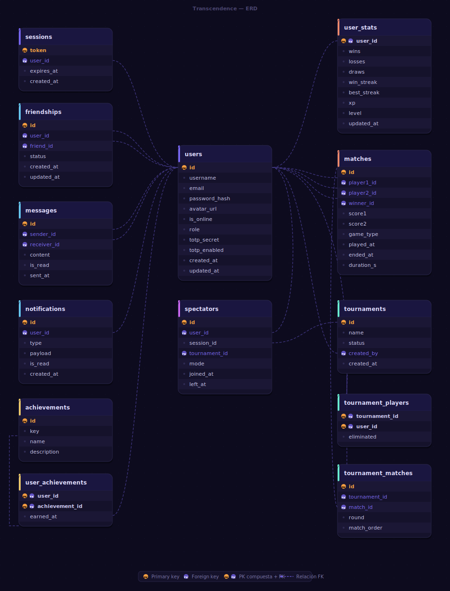

*This project has been created as part of the 42 curriculum by aprenafe, isegura-, mmarinov, vberdugo.*

---

# Enuma Fighter — ft_transcendence

## Description

**Enuma Fighter** is a real-time multiplayer brawler game built as a full-stack web application, created as the final project of the 42 Common Core.

Up to 8 players connect simultaneously and fight in live matches. The game supports 1v1 duels, multi-player free-for-all sessions, and structured tournaments with a single-elimination bracket. Spectators can watch any ongoing match in real time. A full social layer — friends, direct chat, notifications, and profiles — runs alongside the game.

**Key features:**
- Web-based brawler ("Enuma Fighter") built with Raylib compiled to WebAssembly
- Real-time multiplayer via WebSocket — 60 Hz authoritative server loop
- 4 playable characters (Eldwin, Hilda, Quimbur, Gabriel) with distinct stats and move sets
- Tournament system with single-elimination bracket
- Spectator mode (overflow + voluntary)
- Friends system, direct chat, and in-app notifications
- Achievements, XP/level progression, and leaderboard
- React frontend + Express backend + PostgreSQL database
- Fully containerized with Docker — single command to run

---

## Team Information

| Login | Role | Responsibilities |
|---|---|---|
| aprenafe | Project Manager + Developer | Team coordination and progress tracking. Achievements, stats, chat, notifications backend; Achievements/Chat/Leaderboard/Notifications pages; multi-browser support. |
| isegura- | Developer | Login/Register pages, Tournament UI, Privacy/Terms pages, HTTPS/nginx, frontend form validation, `.env.example`. |
| mmarinov | Technical Lead + Developer | Architecture decisions and code quality. Friends, profile, GDPR backend; Friends/Game/Home/Notifications/Profile pages. |
| vberdugo | Product Owner + Developer | Defines priorities and validates completed work. Game engine, physics loop, WebSocket server, auth, matchmaking, AI opponent, spectator routing. |

---

## Project Management

- **Task tracking:** GitHub Issues — one issue per feature, assigned to the responsible developer
- **Branches:** `feat/<feature>-<login>` per feature; PRs reviewed by at least one other member before merge
- **Meetings:** weekly sync to review progress and resolve blockers
- **Communication:** Whasapp — dedicated group and general coordination

---

## Instructions

### Prerequisites

- Docker and Docker Compose
- GNU Make
- Latest stable Google Chrome (or Firefox / Safari / Edge)

### Setup and run

```bash
make
```

On first run this takes approximately 15 minutes (compiles Raylib to WASM, builds all images, starts all containers).

If `.env` does not exist, `make` creates it automatically from `.env.example` — no manual setup required.

Open **https://localhost:8443** in your browser and accept the self-signed certificate.

> To use custom credentials or ports, copy `.env.example` to `.env`, edit it, then run `make`.

### Make commands

| Command | Description |
|---|---|
| `make` | First-time setup + full build + start |
| `make wasm` | Recompiles `main.c` to WASM only, then restarts |
| `make up` | Starts all containers without rebuilding |
| `make dev` | Starts with logs in the terminal (Ctrl+C to stop) |
| `make re` | Stops + recompiles WASM + restarts |
| `make logs` | Streams logs from all services |
| `make logs-<service>` | Streams logs from a specific service |
| `make shell-<service>` | Opens a shell inside a container |
| `make down` | Stops all containers |
| `make clean` | Full reset — removes all images and volumes |

---

## Technical Stack

| Layer | Technology | Why |
|---|---|---|
| Frontend | React 18 (Vite) | Component model, fast HMR, large ecosystem |
| Game engine | Raylib → WebAssembly via Emscripten | Proven 2D engine, runs in-browser with no plugins |
| Backend | Express (Node.js) | Lightweight, straightforward WebSocket integration |
| Database | PostgreSQL | Relational schema, strong consistency, `pg` driver |
| Real-time | WebSocket (`ws` library) | Full-duplex, low latency, native browser support |
| Proxy / TLS | nginx | TLS termination, static file serving, reverse proxy |
| Containerization | Docker Compose | Single-command deployment, reproducible environment |
| Auth | bcrypt + opaque session tokens | Secure password hashing, cookie-based sessions |

---

## Architecture

```
BROWSER
  │
  ▼
nginx :443  (HTTPS / TLS termination)
  ├── /          → frontend :80   (React static build + WASM assets)
  ├── /api/*     → backend :3000  (Express REST API)
  └── /ws        → backend :3000  (WebSocket — 60 Hz game loop)
                        │
                        ▼
                   PostgreSQL :5432
```

---

## Project Structure

```
.
├── Makefile
├── README.md
├── backend/
│   ├── Dockerfile
│   ├── package.json
│   └── src/
│       ├── auth.js                 ← Register, login, logout, session      (vberdugo)
│       ├── db.js                   ← PostgreSQL pool
│       ├── index.js                ← Entry point, WS + REST routes         (vberdugo)
│       ├── game/
│       │   ├── achievements.js     ← Achievement detection and granting    (aprenafe)
│       │   ├── ai.js               ← AI bot opponent                       (vberdugo)
│       │   ├── constants.js        ← Game constants                        (vberdugo)
│       │   ├── physics.js          ← Collisions, voltage, hitstop          (vberdugo)
│       │   ├── session.js          ← Match logic, matchmaking, spectators  (vberdugo)
│       │   └── stats.js            ← Streaks, match duration               (aprenafe)
│       ├── social/
│       │   ├── chat.js             ← Direct messages                       (aprenafe)
│       │   ├── friends.js          ← Friends system                        (mmarinov)
│       │   ├── notifications.js    ← Notifications                         (aprenafe)
│       │   └── profile.js          ← User profile                          (mmarinov)
│       └── ws/
│           └── handler.js          ← WebSocket event handler               (vberdugo)
├── database/
│   ├── erd.svg
│   └── init.sql                    ← Schema, indexes, seed data            (All)
├── docker-compose.yml
├── frontend/
│   ├── Dockerfile                  ← Stage 1: C→WASM / Stage 2: React / Stage 3: nginx
│   ├── app/
│   │   ├── index.html
│   │   ├── package.json
│   │   ├── vite.config.js
│   │   └── src/
│   │       ├── App.jsx
│   │       ├── main.jsx
│   │       ├── Achievements.jsx    ← User achievements                     (aprenafe)
│   │       ├── Chat.jsx            ← Direct messages                       (aprenafe)
│   │       ├── Friends.jsx         ← Friends list                          (mmarinov)
│   │       ├── Game.jsx            ← Game canvas + char select             (mmarinov)
│   │       ├── Home.jsx            ← Landing page / lobby                  (mmarinov)
│   │       ├── Leaderboard.jsx     ← Top 10 players                        (aprenafe)
│   │       ├── Login.jsx           ← Login form                            (isegura-)
│   │       ├── Notifications.jsx   ← In-app notifications                  (mmarinov)
│   │       ├── Privacy.jsx         ← Privacy Policy                        (isegura-)
│   │       ├── Profile.jsx         ← User profile                          (mmarinov)
│   │       ├── Register.jsx        ← Register form                         (isegura-)
│   │       ├── Terms.jsx           ← Terms of Service                      (isegura-)
│   │       └── Tournament.jsx      ← Tournament bracket UI                 (isegura-)
│   ├── game/src/
│   │   ├── bones_core.h
│   │   ├── main.c                  ← Raylib game source                    (vberdugo)
│   │   ├── raylib.h
│   │   ├── raymath.h
│   │   ├── rlgl.h
│   │   └── data/                   ← Animations, portraits, textures, VFX
│   └── js/
│       └── ws-client.js            ← WebSocket ↔ WASM bridge              (vberdugo)
└── nginx/
    ├── Dockerfile                  ← Generates self-signed HTTPS cert      (isegura-)
    └── nginx.conf                                                           (isegura-)
```

---

## Database Schema



| Table | Purpose |
|---|---|
| `achievements` | Achievement catalogue — key, name, description |
| `friendships` | Friend graph — status: pending / accepted / blocked |
| `matches` | Match history — players, scores, winner, duration, game type |
| `messages` | Direct chat — sender, receiver, content, read flag |
| `notifications` | In-app notifications — type, JSONB payload, read flag |
| `sessions` | Auth tokens — opaque token, user FK, expiry (7 days) |
| `spectators` | Spectator log — session watched, mode, joined_at, left_at |
| `tournament_matches` | Matches belonging to each tournament round |
| `tournament_players` | Players registered in each tournament |
| `tournaments` | Tournament metadata — name, status, creator |
| `user_achievements` | Unlocked achievements per user — earned_at |
| `user_stats` | Game stats — wins, losses, xp, level, win_streak, best_streak |
| `users` | Accounts — username, email, bcrypt hash, avatar, role |

---

## Modules

### Mandatory part (all team members contributed)

The mandatory part is the shared foundation every team member built and owns collectively: React frontend, Express backend, PostgreSQL database, Docker containerization, HTTPS via nginx, basic auth (register/login), Privacy Policy and Terms of Service pages, and full frontend + backend form validation.

| Mandatory requirement | Who contributed |
|---|---|
| React frontend (pages, routing, styling) | aprenafe, isegura-, mmarinov, vberdugo |
| Express backend (REST API, middleware) | aprenafe, mmarinov, vberdugo |
| PostgreSQL database + schema | aprenafe, mmarinov, vberdugo |
| Docker Compose + Dockerfiles | isegura-, vberdugo |
| HTTPS / nginx configuration | isegura- |
| Auth system (register, login, sessions) | isegura- (forms), vberdugo (backend) |
| Privacy Policy + Terms of Service pages | isegura- |
| Frontend + backend form validation | isegura- (frontend), vberdugo (backend) |
| `.env.example` + environment setup | isegura- |

### Chosen modules

| Module | Type | Pts | Owner | Justification |
|---|---|---|---|---|
| Use a framework (React + Express) | Major | 2 | All | React 18 + Vite frontend; Express backend — full-stack separation with REST API and SPA routing. |
| Real-time features via WebSocket | Major | 2 | vberdugo | `ws` library drives the 60 Hz authoritative game loop; all clients stay in sync via state snapshots. |
| Allow users to interact (chat + friends + profile) | Major | 2 | aprenafe + mmarinov | Direct messaging, friends graph with accept/block, and profile pages — core social layer of the app. |
| Web-based game (Enuma Fighter) | Major | 2 | vberdugo | Raylib → WASM runs in-browser. Server-side physics, 4 characters with distinct move sets and a voltage system. |
| Remote players | Major | 2 | vberdugo | Players on separate browsers play live via WebSocket with input buffering and reconnection logic. |
| Multiplayer 3+ players | Major | 2 | vberdugo | Sessions support up to 8 simultaneous players; authoritative server handles sync and fair scoring. |
| AI Opponent | Major | 2 | vberdugo | `game/ai.js` — heuristic bot with randomized reaction delays injecting synthetic inputs every tick. |
| Game customization (characters + abilities) | Minor | 1 | vberdugo | 4 selectable characters with distinct stats and abilities; selection screen before each match. |
| Gamification (achievements + XP + leaderboard) | Minor | 1 | aprenafe | Server-side achievements, XP/level in `user_stats`, top-10 leaderboard — all persisted in PostgreSQL. |
| Game statistics and match history | Minor | 1 | aprenafe | Per-user wins, losses, streaks in `user_stats`; full match log in `matches`; displayed on the profile page. |
| GDPR compliance | Minor | 1 | mmarinov | Endpoints to export all personal data (JSON) and permanently delete an account, accessible from the profile. |
| Multiple browser support | Minor | 1 | aprenafe | Full feature parity tested on Firefox, Safari, and Edge; browser-specific quirks documented. |
| Spectator mode | Minor | 1 | vberdugo | Overflow and voluntary spectators receive live state broadcasts without sending input. |
| Tournament system | Minor | 1 | isegura- | Single-elimination bracket in `tournaments` / `tournament_matches`; auto-advances on match completion. |

**Total: 19 points** (14 mandatory + 5 bonus)

---

## Features

| Feature | Files | Owner |
|---|---|---|
| Achievements backend + page | `game/achievements.js`, `Achievements.jsx` | aprenafe |
| Chat backend + page | `social/chat.js`, `Chat.jsx` | aprenafe |
| Leaderboard page | `Leaderboard.jsx` | aprenafe |
| Notifications backend + page | `social/notifications.js`, `Notifications.jsx` | aprenafe |
| Stats backend + multi-browser support | `game/stats.js` | aprenafe |
| Login + Register pages + form validation | `Login.jsx`, `Register.jsx` | isegura- |
| Tournament UI | `Tournament.jsx` | isegura- |
| Privacy Policy + Terms of Service | `Privacy.jsx`, `Terms.jsx` | isegura- |
| HTTPS / TLS + nginx + `.env.example` | `nginx/Dockerfile`, `nginx/nginx.conf` | isegura- |
| Friends backend + page | `social/friends.js`, `Friends.jsx` | mmarinov |
| Profile backend + page | `social/profile.js`, `Profile.jsx` | mmarinov |
| GDPR endpoints | `social/profile.js` | mmarinov |
| Home + Game + Notifications pages | `Home.jsx`, `Game.jsx`, `Notifications.jsx` | mmarinov |
| Game engine + physics + AI | `main.c`, `physics.js`, `session.js`, `game/ai.js` | vberdugo |
| Auth system + WebSocket server | `auth.js`, `ws/handler.js`, `index.js` | vberdugo |
| WS↔WASM bridge + Docker setup | `ws-client.js`, `docker-compose.yml`, Dockerfiles | vberdugo |

---

## Individual Contributions

### aprenafe — Project Manager + Developer
- `game/achievements.js`: server-side detection and granting of achievements (`first_win`, `veteran` — more to be added)
- `game/stats.js`: win streak, best streak, and match duration tracking
- `social/chat.js`: direct messaging backend — storage, retrieval, read-flag management
- `social/notifications.js`: notification creation, delivery, and all social event triggers
- React pages: `Achievements.jsx`, `Chat.jsx`, `Leaderboard.jsx`, `Notifications.jsx`
- Multi-browser support: tested and documented on Firefox, Safari, and Edge
- Team coordination: weekly syncs, GitHub Issues board, unblocked cross-module dependencies
- **Challenge:** Achievements needed to fire after every match without slowing the game loop. Solved by running checks asynchronously after the match is committed to the database.

### isegura- — Developer
- `Login.jsx` and `Register.jsx`: auth forms with client-side validation (format, length, required fields)
- `Tournament.jsx`: dynamic single-elimination bracket, recursive layout for any power-of-two participant count
- `Privacy.jsx` and `Terms.jsx`: policy pages accessible from the footer on every page
- nginx: HTTPS configuration with automatic self-signed certificate generation at container startup
- Frontend form validation across all user-facing forms
- `.env.example`: all environment variables documented with safe defaults
- **Challenge:** Rendering the bracket dynamically for 4, 8, or 16 participants required a recursive tree layout. Solved with a bracket-builder utility that computes positions and bye slots from the player count.

### mmarinov — Technical Lead + Developer
- `social/friends.js`: friends backend — send/accept/block, online status
- `social/profile.js`: profile backend — avatar upload, stats aggregation, match history
- GDPR endpoints: personal data export (JSON) and permanent account deletion with cascade
- React pages: `Friends.jsx`, `Game.jsx`, `Home.jsx`, `Notifications.jsx`, `Profile.jsx`
- Architecture decisions: service boundaries, REST contract, database schema ownership, code review standards
- **Challenge:** Profile page needed data from four tables without N+1 queries. Solved with a single JOIN query fetching everything in one round trip.

### vberdugo — Product Owner + Developer
- Game engine: Raylib → WASM, `main.c`, authoritative physics loop at 60 Hz
- WebSocket server: connection lifecycle, input frames, state broadcasting, reconnection (`ws/handler.js`)
- Session management: 1v1, free-for-all (3–8 players), spectator routing (`game/session.js`)
- 4 playable characters with distinct stats, voltage system, hitstop, combo detection
- Auth system: register, login, logout, bcrypt, opaque session cookies (`auth.js`)
- Remote players, multiplayer 3+ support, tournament backend
- AI Opponent (`game/ai.js`): heuristic bot with randomized reaction delays
- **Challenge:** Syncing state across 8 WebSocket clients at 60 Hz required minimizing payload size. Solved by profiling and switching to a flat JSON structure that reduced parsing time on the client.

---

## Resources

- [Raylib documentation](https://www.raylib.com/)
- [Emscripten documentation](https://emscripten.org/docs/)
- [React documentation](https://react.dev/)
- [Express documentation](https://expressjs.com/)
- [PostgreSQL documentation](https://www.postgresql.org/docs/)
- [WebSocket API (MDN)](https://developer.mozilla.org/en-US/docs/Web/API/WebSockets_API)
- [bcrypt (npm)](https://www.npmjs.com/package/bcrypt)
- [node-postgres (pg)](https://node-postgres.com/)
- [GDPR — European Commission](https://commission.europa.eu/law/law-topic/data-protection_en)

**AI usage:** AI tools were used to support documentation drafting, architecture discussion, code review, and breaking down technical problems into smaller steps. All AI-generated suggestions were critically reviewed and tested by the team before being applied. No AI-generated code was merged without full understanding by the responsible developer.
